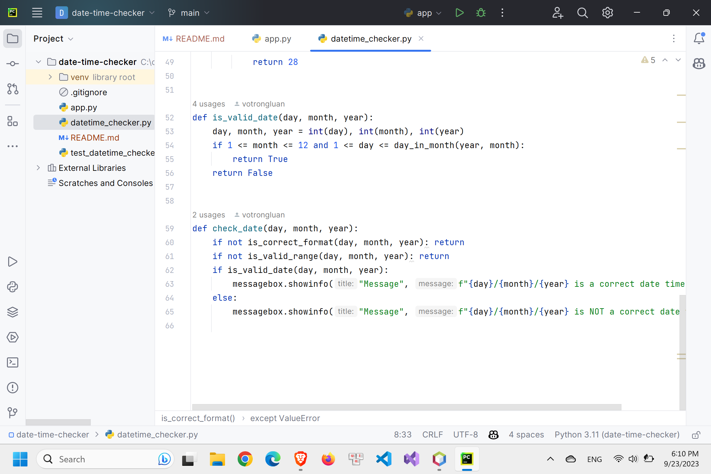
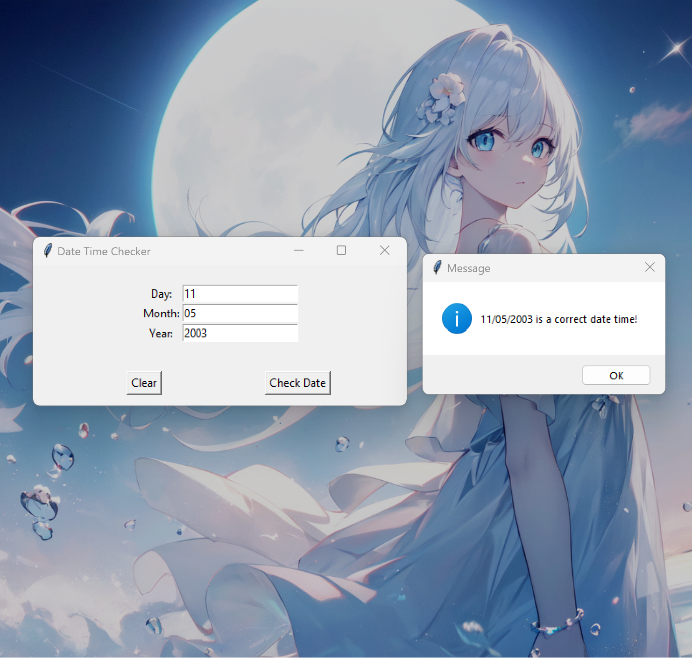

# Date Time Checker GUI app with Python

## You will find in this repo the following stuff:

- The datetime_checker library that offers multiples function that validate the date (a Python-based source code)
- Unit Testing source code with `unittest`
- ...

## Screenshots

#### © 2023 votrongluan
